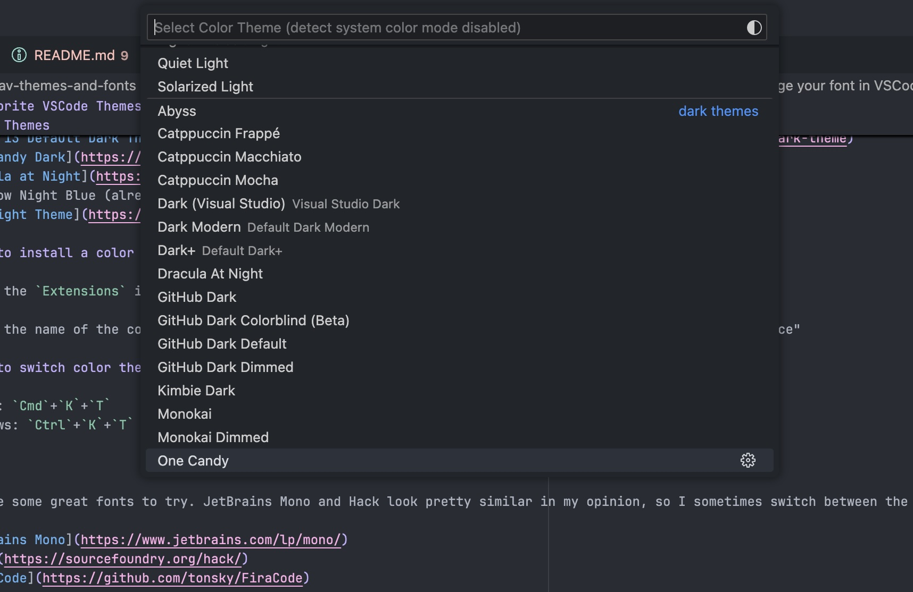

# My favorite VSCode Themes and Fonts

## Color Themes

- [Catppuccin](https://marketplace.visualstudio.com/items?itemName=Catppuccin.catppuccin-vsc-pack)
  - Bonus: [Catppuccin Icons for VSCode](https://marketplace.visualstudio.com/items?itemName=Catppuccin.catppuccin-vsc-icons)
- [Xcode 13 Default Dark Theme](https://marketplace.visualstudio.com/items?itemName=Colaski.xcode-13-default-dark-theme)
- [One Candy Dark](https://marketplace.visualstudio.com/items?itemName=KacperBiedka.one-candy-dark)
- [Dracula at Night](https://marketplace.visualstudio.com/items?itemName=bceskavich.theme-dracula-at-night)
- Tomorrow Night Blue (already bundled with VSCode)
- [Palenight Theme](https://marketplace.visualstudio.com/items?itemName=whizkydee.material-palenight-theme)

### How to install a color theme extension in VSCode

1. Click the `Extensions` icon on the left tab menu.

2. Enter the name of the color theme extension in the top search bar that says "Search Extensions in Marketplace"

### How to switch color themes

Shortcut on MacOS: `Cmd`+`K`+`T`

Shortcut on Windows: `Ctrl`+`K`+`T`

A dropdown should appear where you can quick select a color theme.

## Fonts

These are some great fonts to try. JetBrains Mono and Hack look pretty similar in my opinion, so I sometimes switch between the two.

- [JetBrains Mono](https://www.jetbrains.com/lp/mono/)
- [Hack](https://sourcefoundry.org/hack/)
- [Fira Code](https://github.com/tonsky/FiraCode)

### How to change your font in VSCode

1. Navigate to your global VSCode settings. The shortcut on MacOS is `Cmd`+`,`.

2. Under `Commonly Used` > `Editor: Font Family`, enter the font family you would like to use at the start of the comma-separated list of strings.

<!-- TODO: Add screenshots and example -->

> Photo by [Mohammad Rahmani](https://unsplash.com/@afgprogrammer?utm_content=creditCopyText&utm_medium=referral&utm_source=unsplash) on [Unsplash](https://unsplash.com/)
